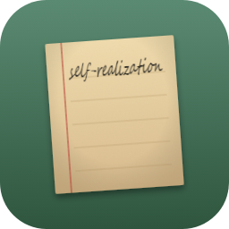
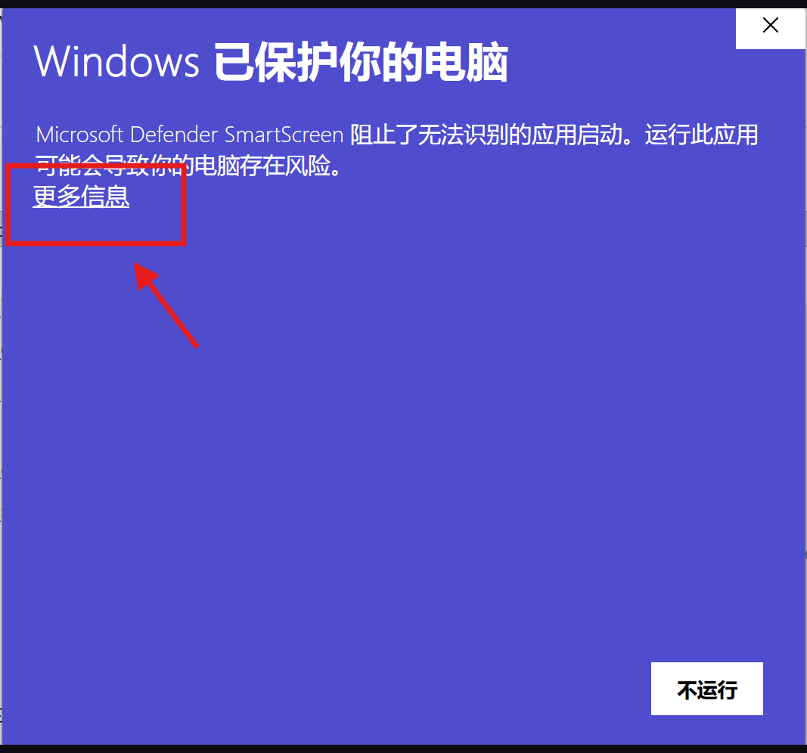

# 字己 · 私人的文字档案馆

> 本地优先的个人文字档案。用文字记录自己，在回看中认识自己和理解自己，发现生命的留痕。

<p align="center">
  
</p>

---
## 开发者想说的话
>
>关于字己  
>字己是一款坚持本地优先的，个人文字档案。我的出发点是，希望用极简的形式和沉浸感，打造一个以记录为目的纯文字写作应用。希望通过记录，用文字认识自己，也在回看中自我观察和自我治愈。
>
> 关于我的初心  
>用自己的文字回答，我是谁？。从十几岁开始，“我是谁”这个问题总在一些时候出现，质问我，那些面具都不是你，你是谁？这个问题伴随了我的成长，一直到20多岁的某天，我无法接受自己对这个问题的逃避，面具的生活似乎填满了我之前的生命，我总是不给那个我是谁一些呼吸的空间。为了回答这个问题，我亲手摘掉了社会面具，我不再把重心放在做好员工、做好女儿等角色上，我花了3年直面它，这3年，我对这个问题的关注几乎摧毁了我。我做了一切可能帮我找到答案的事情，裸辞学滑雪冲浪，兴趣社交、旅游、体验、阅读、学习，玄学算命，从哲学、心理学、玄学各种领域中寻找。同时，每当这个问题浮现，我都开始记录自己，记录脑中的一切声音。直到半年前，我才发现，我一直都在，那个妈妈的好女儿，那个公司的好员工，那个承担社会角色和不愿意承担角色的人就是我，那个像孩子一样蹲在路边看野花的人是我，那个理性面对未来的人是我，那个深夜怀疑存在感的人是我。我从自己的文字中发现怀疑、沮丧、空虚，也发现感恩、温暖和治愈。写下来救了我，它在我和敏感的头脑之间创造了呼吸的空间，它打开了一条裂缝，让光照了进来。
>
>关于写作  
>说写作我们会联想到一部完整的作品和优美的造词，但是我认为这是我们人为制造的门槛，我们每个人都有能力也有权力去进行自我的写作，不需要文字功底不需要语言优美，只需要你用自己的话，表达出真实的你、你的想法、你的感受、你的自我怀疑与自我肯定。所有的这些文字终将勾勒出一个完整的你。
>
>关于形式  
>为什么我一开始只做windows？手机端确实更方便，但是手机制造的其他诱惑也太多，我希望设定一种轻仪式，手机放一旁，打开电脑，不需要网络，只需要通过键盘敲下你脑中浮现出的话。后续在客户端稳定后，会继续开发移动端，但也可能主要以预览为主，是否提供编辑我还在考虑。
>
>关于ai  
>有一部分声音会嘲笑在ai时代去开发一款传统的文字应用，毫无创新和竞争力。原因是，我并没有从形式和功能出发，我是从数据出发，我希望完全从数据端拥有和控制我的文字，应用本身只是一个工具和桥梁，连接我的数据，我随时可以将数据连接到其他地方，无需导出。所以在ai普及的当下，这种形式反而让我感到安全。我可以自由选择是否向它暂时的分享我的数据，可能用于帮我结构化的理解自己，可能用于从他处写入数据。用法灵活且全由我个人控制。

## 字己是什么


**字己** 是一款专注自己内心，以文字为符号，认识自己的写作记录应用。它不是博客平台，不是笔记软件，也不以公开发布为出发点——它是一个安静、私密的**个人文字档案馆**。它希望传递的是，你不需要有作家的文笔，不需要使用丰富华丽的辞藻，你只需要用最朴实的文字，记录头脑中发生的对话，记录生活中让你感恩的事情、或者让你在心里一直过不去的。通过写下来这个动作，让你和自己真诚对话，让你把温柔和关怀留给自己，并从自己的文字中获得治愈、暖暖和前进的力量。

你写的每篇文章都以通用的 `.md`格式 文件保存在你选择的本地文件夹里，无需账号、无需联网、数据完全归你所有。你可以选择任意的备份存储方式，也可以借助工具或者个人ai分析你的文字，帮你发现你忽视的课题，或者自己美好的一面。外部产生的对话内容也可以以`.md`格式 文件回存，让你在字己中浏览。

---

## 核心功能

| 功能 | 说明 |
|------|------|
| ✍️ **Markdown 写作** | 标题、正文、分类、标签，支持常用 Markdown 快捷键 |
| 📂 **本地文件夹管理** | 文章以 `.md` + YAML Front Matter 保存，开放格式，随时迁移 |
| 🔍 **全文搜索** | 按标题、正文、标签搜索，300ms 防抖，不区分英文大小写 |
| 🏷️ **分类与标签** | 从文章提取分类和标签，一键筛选浏览 |
| 📊 **写作日历** | GitHub 风格贡献图，可视化每日字数和写作活跃度 |
| 📝 **草稿自动保存** | 编辑过程中自动保存草稿，防止内容丢失 |
| 🔄 **备份与回收站** | 编辑时自动备份原文件，删除文章移入回收站而非直接销毁 |
| 🎨 **多主题** | 内置多套配色主题，一键切换 |
| 🌲 **图片相册** | 首页可上传个人图片，增强私人空间感 |
| 🖥️ **纯本地运行** | 不依赖云端服务，离线也能正常使用 |
| 😊 **每日问候引导语**|不知道写什么时候，只需要打开字己，点击当日引导语开始写作|


---
## 产品文档

完整的产品说明、定位、功能设计与数据结构见 [产品文档](产品文档.md)。

## 下载安装

1. 前往 [Releases](https://github.com/selfr7/ziji-releases/releases) 下载最新安装程序 `ZiJi-Setup-*.exe`
2. 双击运行，按提示完成安装

系统要求：Windows 10 及以上（所需 WebView2 运行时在 Windows 11 已内置）。

### 看到“Windows 已保护你的电脑”？

这是正常现象，不用担心。字己由个人独立开发，尚未进行商业代码签名，而 Windows 会**对所有未签名的软件**显示这个蓝色提示——这是系统默认防护，并不代表软件有安全问题。

按下面两步继续安装：

1. 点击提示窗中的 **「更多信息」**
2. 点击 **「仍要运行」**



---

## 数据说明

### 文章格式

每篇文章是一个 `.md` 文件，包含 YAML Front Matter 和正文：

```markdown
---
title: "今天的记录"
category: "日记"
tags: ["情绪", "自我观察"]
date: "2026-06-11"
word_count: 300
---

正文内容...
```

### 数据存储位置

| 数据 | 路径 |
|------|------|
| 应用配置 | `~/.config/ziji/config.json` |
| 文章文件 | 用户自选文件夹 |
| 编辑备份 | `<文章文件夹>/.selfrblog-backups/` |
| 回收站 | `<文章文件夹>/.selfrblog-trash/` |

---

## 快捷键

| 快捷键 | 功能 |
|--------|------|
| `Ctrl + S` | 保存文章 |
| `Ctrl + N` | 新建文章 |
| `Ctrl + F` | 聚焦搜索框 |
| `Esc` | 返回列表 |
| `Ctrl + B` | 粗体 |
| `Ctrl + I` | 斜体 |
| `Ctrl + K` | 插入链接 |
| `Ctrl + Shift + X` | 删除线 |
| `Ctrl + Shift + C` | 行内代码 / 代码块 |
| `Ctrl + Shift + B` | 引用块 |
| `Ctrl + Shift + L` | 无序列表 |
| `Ctrl + Shift + O` | 有序列表 |
| `Ctrl + Shift + H` | 标题 |
| `Ctrl + Shift + I` | 图片语法 |

---

## 产品理念

- **本地优先** —— 数据归你所有，不绑定账号，不锁定格式
- **写给自己** —— 默认场景是记录和回看，不是发布和传播
- **安静克制** —— 只提供必要的整理能力，不制造系统维护负担
- **长期陪伴** —— 为持续写作和自我观察而设计，不是短期工具

