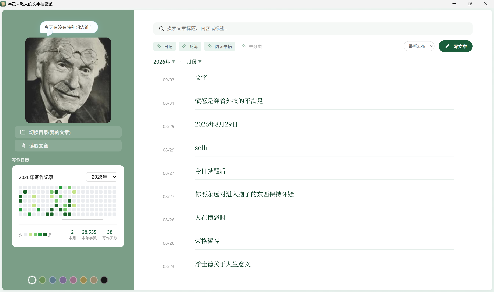

<p align="center">
  
</p>

# 字己 · 私人的文字档案馆

> 本地优先的个人文字档案。用文字记录自己，在回看中认识自己和理解自己，发现生命的留痕。

<p align="center">
  
</p>

---

## 开发者想说的话

### 关于字己
字己是一款坚持**本地优先**的个人文字档案。我的出发点是，希望用极简的形式和沉浸感，打造一个以记录为目的的纯文字写作应用。希望通过记录，用文字认识自己，也在回看中自我观察和自我治愈。

### 关于我的初心
> 用自己的文字回答：**我是谁？**

从十几岁开始，“我是谁”这个问题总在一些时候出现，质问我：“那些面具都不是你，你是谁？”这个问题伴随了我的成长。一直到 20 多岁的某天，我无法再接受自己对这个问题的逃避，面具的生活似乎填满了我之前的生命，我总是不给那个“我是谁”一些呼吸的空间。

为了回答这个问题，我亲手摘掉了社会面具，不再把重心放在做好员工、做好女儿等角色上。我花了 3 年直面它——这 3 年，我对这个问题的执着几乎摧毁了我。我做了一切可能帮我找到答案的事情：裸辞学滑雪冲浪、兴趣社交、旅游、体验、阅读、学习、算命，从哲学、心理学、玄学各种领域中寻找答案。同时，每当这个问题浮现，我都开始记录自己，记录脑中的一切声音。

直到半年前，我才发现：**我一直都在**。那个妈妈的好女儿、那个公司的好员工、那个承担社会角色和不愿意承担角色的人就是我；那个像孩子一样蹲在路边看野花的人是我；那个理性面对未来的人是我；那个深夜怀疑存在感的人也是我。

我从自己的文字中发现怀疑、沮丧、空虚，也发现感恩、温暖和治愈。**写下来救了我，它在我和敏感的头脑之间创造了呼吸的空间，它打开了一条裂缝，让光照了进来。**

### 关于写作
说到写作，我们常会联想到一部完整的作品和优美的文采，但我认为这是人为制造的门槛。

我们每个人都有能力、也有权利进行自我的写作。不需要文字功底，不需要语言优美，只需要你用自己的话，表达出真实的你、你的想法、你的感受、你的自我怀疑与自我肯定。所有的这些文字，终将勾勒出一个完整的你。

### 关于形式（为什么先做 Windows）
手机端确实更方便，但手机制造的其他诱惑也太多。我希望设定一种**轻仪式**：手机放一旁，打开电脑，不需要网络，只需通过键盘敲下你脑中浮现的话。

后续在客户端稳定后，会继续开发移动端；移动端可能主要以浏览预览为主，是否提供编辑功能我还在考虑中。

### 关于 AI 与数据自主
在 AI 时代去开发一款传统的文字应用，或许会有人觉得不够新颖。但我并不是从形式和功能出发，而是**从数据出发**：我希望完全从数据端拥有和控制我的文字。

应用本身只是一个工具和桥梁，连接你的数据。你的数据随时可以连接到其他工具，无需导出。在 AI 普及的当下，这种形式反而让我感到安全：你可以自由选择是否向 AI 暂时分享你的数据（用于帮你结构化地理解自己，或从外部写入数据），用法灵活，且**全由你个人控制**。

---

## 字己是什么

**字己** 是一款专注内心、以文字为符号、认识自己的写作记录应用。

它不是博客平台，不是笔记软件，也不以公开发布为目的——它是一个安静、私密的**个人文字档案馆**。

- **无需文采，真诚对话**：记录头脑中发生的对话，记录生活中的感恩与过不去的坎，把温柔和关怀留给自己，从中获得治愈与前行的力量。
- **本地优先，开放格式**：每篇文章均以通用的 `.md` 格式保存在本地自选目录，无账号、无云端依赖、随时可自由迁移。
- **数据自由，无限延伸**：你可以任意备份，也可以借助第三方工具或个人 AI 分析文字，发现被忽视的课题与自我美好的一面。

---

## 核心功能

| 功能 | 说明 |
|------|------|
| ✍️ **Markdown 写作** | 标题、正文、分类、标签，支持常用快捷键 |
| 📂 **本地文件夹管理** | 文章以 `.md` + YAML Front Matter 保存，格式开放，随时迁移 |
| 🔍 **全文快速搜索** | 按标题、正文、标签检索，300ms 防抖，不区分英文大小写 |
| 🏷️ **分类与标签** | 自动提取分类和标签，一键筛选与聚焦 |
| 📊 **写作活跃日历** | GitHub 风格热力图，直观呈现每日字数与写作轨迹 |
| 📝 **草稿自动防丢** | 编辑过程中实时暂存，防止误关丢失 |
| 🔄 **安全备份与回收** | 编辑时自动保留原文件备份，删除文章移入回收站而非直接销毁 |
| 🎨 **多套精致主题** | 内置多套配色风格，随时一键切换 |
| 🌲 **私人相册空间** | 首页可自定义上传背景与图片，营建专属私人角落 |
| 🖥️ **纯粹本地离线** | 绝不依赖外部网络与云端服务器，完全离线运行 |
| 😊 **每日问候引导语** | 不知写什么时，打开字己点击当日引导语即可轻松提笔 |

---

## 产品文档

完整的产品定位、功能设计与数据结构规范见 [产品文档](产品文档.md)。

---

## 下载安装

1. 前往 [Releases](https://github.com/selfr7/ziji-releases/releases) 下载最新 Windows 安装包 `ZiJi-Setup-*.exe`
2. 双击运行，按提示完成安装

> **系统要求**：Windows 10 及以上（Windows 11 已内置所需 WebView2 运行时）。

### 看到“Windows 已保护你的电脑”？

这是正常现象。字己由个人独立开发，尚未进行商业代码签名，Windows 会对所有未签名的新软件显示此安全提示，并不代表软件存在风险。

只需按下面两步继续即可：
1. 点击提示窗中的 **「更多信息」**
2. 点击右下角出现的 **「仍要运行」**


---

## 数据说明

### 文章存储格式

每篇文章均为标准的 `.md` 纯文本文件，包含 YAML Front Matter 元数据与正文：

```markdown
---
title: "今天的记录"
category: "日记"
tags: ["情绪", "自我观察"]
date: "2026-06-11"
word_count: 300
---

正文内容...
```

### 数据存储路径

| 数据类型 | 实际存储路径 |
|----------|--------------|
| 应用基础配置 | `~/.config/ziji/config.json` |
| 文章主数据 | 用户自选文件夹（所有 `.md` 文件） |
| 编辑历史备份 | `<文章文件夹>/.selfrblog-backups/` |
| 本地回收站 | `<文章文件夹>/.selfrblog-trash/` |

---

## 常用快捷键

| 快捷键 | 功能 | 快捷键 | 功能 |
|--------|------|--------|------|
| `Ctrl + S` | 保存文章 | `Ctrl + N` | 新建文章 |
| `Ctrl + F` | 聚焦搜索框 | `Esc` | 返回文章列表 |
| `Ctrl + B` | 粗体文本 | `Ctrl + I` | 斜体文本 |
| `Ctrl + K` | 插入超链接 | `Ctrl + Shift + X` | 删除线 |
| `Ctrl + Shift + C` | 行内代码 / 代码块 | `Ctrl + Shift + B` | 引用区块 |
| `Ctrl + Shift + L` | 无序列表 | `Ctrl + Shift + O` | 有序列表 |
| `Ctrl + Shift + H` | 标题样式 | `Ctrl + Shift + I` | 插入图片语法 |

---

## 产品理念

- **本地优先** —— 数据完全归你所有，不绑定账号，不锁定私有格式
- **写给自己** —— 默认场景是记录与自我对话，不是为了公开发布与迎合他人
- **安静克制** —— 只提供必要的书写与整理能力，不制造多余的认知负担
- **长期陪伴** —— 为持续记录、自我观察与生命留痕而设计

---

## 使用与权利声明

字己由个人独立设计与开发，免费提供给所有需要的人使用。

本产品的所有设计、文字、视觉资产及程序逻辑均受版权保护。请尊重原创劳动，未经作者书面许可，请勿抄袭、反编译或将相关资源用于二次商业化打包与分发。

Copyright © 2026 selfr7. All Rights Reserved.
